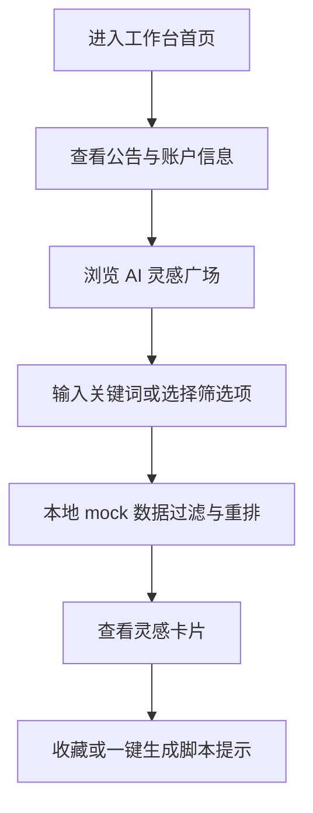

## 1. 产品概述
本项目用于在本地手写复现即创工作台当前页面的前端视觉与基础交互，仅覆盖当前工作台页，不包含登录、子页面、真实后端和真实接口。
- 主要目标是构建一个可运行的静态前端页面，用 mock 数据模拟“AI灵感广场 / 热门素材”内容流、筛选、搜索、收藏与视图切换等前端状态。
- 目标用户是需要进行页面还原、视觉走查、前端原型展示或交互演示的设计与研发人员。

## 2. 核心功能

### 2.1 功能模块
1. **工作台首页**：顶部公告、账户与项目信息、资产数值、快捷入口、左侧导航、Agent 输入提示、灵感内容区。
2. **灵感内容区**：搜索框、模块标签、排序与时间筛选、行业/热点/类型/来源筛选、卡片瀑布流。
3. **引导与浮层**：顶部公告关闭、搜索功能提示关闭、筛选下拉面板、收藏状态切换。

### 2.2 页面详情
| 页面名称 | 模块名称 | 功能描述 |
|---|---|---|
| 工作台首页 | 顶部公告条 | 展示“Seedance2.5 即将震撼首发！30s视频直出，支持全模态参考素材！”文案，支持关闭 |
| 工作台首页 | 顶部信息区 | 展示历史任务、用户头像、账户“测试RD_005_PC”、代理商“巨量引擎方舟-测试代理商”、资产数值“1,035,155” |
| 工作台首页 | 左侧导航 | 展示“首页 / 资产 / 工具”三项，首页为选中态 |
| 工作台首页 | Agent 提示区 | 展示“提供商品、参考、确定的脚本或素材可以帮助我更好地创作哦”和计数“0”，支持展开样式演示 |
| 工作台首页 | 灵感页头 | 展示“AI灵感广场”“热门素材”“我的收藏”按钮和搜索框“请输入关键词查找灵感方案” |
| 工作台首页 | 筛选工具条 | 展示“热度高 / 点击率高 / 更多排序 / 近30天 / 不限行业 / 节点热点 / 视频类型 / 视频来源 / 更多筛选” |
| 工作台首页 | 视图切换 | 支持宫格视图和列表视图按钮的前端状态切换 |
| 工作台首页 | 灵感卡片流 | 使用 mock 素材图片、标签、标题、热度、点击率和“一键生成脚本”按钮渲染卡片 |
| 工作台首页 | 新手提示 | 展示“搜索功能升级啦 / 快来试试吧！”提示，支持“跳过 / 我知道啦”关闭 |

## 3. 核心流程
用户进入页面后看到深色工作台与公告条，可以关闭公告或新手提示；用户可通过搜索框输入关键词、点击排序/筛选项改变前端筛选状态，卡片内容根据 mock 数据进行本地过滤；用户可切换收藏状态、切换视图展示，并点击卡片按钮触发本地提示。

## 4. 用户界面设计

### 4.1 设计风格
- 主色：深紫黑背景 `#120d22`、面板紫灰 `#2b223d`、亮紫强调 `#7b4dff`、文本白与浅紫灰。
- 按钮风格：大圆角胶囊按钮、半透明暗色面板、紫色选中态、轻微发光边框。
- 字体与字号：中文界面优先使用系统中文字体栈；标题 20-28px，工具栏 14-16px，卡片正文 13-14px。
- 布局风格：桌面优先，顶部公告 + 顶部信息区 + 左侧悬浮导航 + 主内容瀑布流。
- 图标风格：使用 CSS/文本符号模拟线性图标与简单几何图形，避免依赖真实站点图标资源。

### 4.2 页面设计概览
| 页面名称 | 模块名称 | UI 元素 |
|---|---|---|
| 工作台首页 | 背景 | 深色渐变、点阵纹理、局部紫色光斑 |
| 工作台首页 | 顶部公告条 | 全宽紫色条、左侧公告文案、右侧关闭按钮 |
| 工作台首页 | 顶部信息区 | 胶囊按钮、头像圆点、账户/代理商信息、资产数值 |
| 工作台首页 | 左侧导航 | 垂直胶囊容器、图标、文字、首页高亮 |
| 工作台首页 | 灵感内容区 | 搜索框、标签、筛选栏、收藏按钮、视图切换 |
| 工作台首页 | 卡片流 | 4 列桌面网格，卡片含素材图、标签、标题、热度、点击率和操作按钮 |
| 工作台首页 | 引导层 | 深紫提示卡、箭头/高亮效果、关闭按钮 |

### 4.3 响应式
采用桌面优先设计。宽屏展示 4 列卡片，中等屏幕 3 列，小屏幕 1-2 列；顶部信息和筛选项在窄屏下允许横向滚动，左侧导航缩为底部或紧凑浮层。
