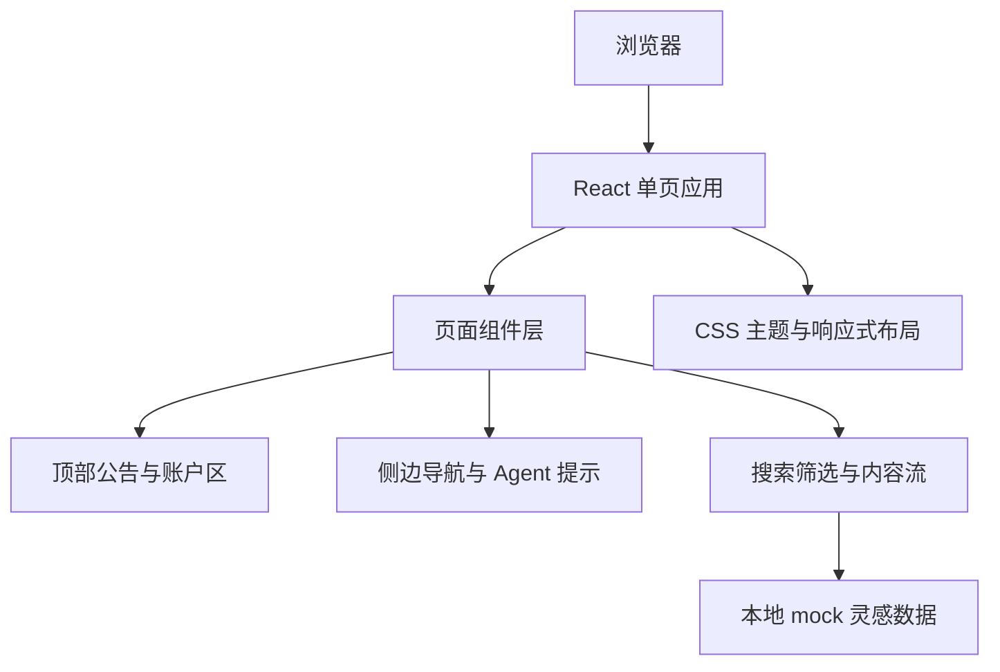

## 1. 架构设计
项目采用单页前端架构，所有业务数据均在前端 mock，不接入真实后端、登录态、接口、埋点或权限系统。



## 2. 技术说明
- 前端：React@18 + TypeScript + Vite。
- 样式：CSS Modules 或普通 CSS，使用 CSS 变量管理深色主题、圆角、阴影和响应式断点。
- 后端：无。
- 数据库：无，使用本地 mock 数组模拟灵感卡片、筛选选项、排序状态和用户信息。
- 图片：不复制真实站点资源；素材卡片图使用规定的文本生图接口生成占位视觉，保证不是空白占位图。

## 3. 路由定义
| 路由 | 用途 |
|---|---|
| `/` | 工作台首页复刻，包含当前页面全部可见模块 |

## 4. 组件划分
| 组件 | 职责 |
|---|---|
| `App` | 页面状态编排、mock 数据过滤、整体布局 |
| `AnnouncementBar` | 顶部 Seedance 公告条与关闭状态 |
| `TopWorkspaceBar` | 历史任务、账户、代理商、资产值和快捷入口 |
| `SideNav` | 首页、资产、工具垂直导航 |
| `AgentPrompt` | 商品/参考/脚本/设置入口和 Agent 输入提示 |
| `InspirationToolbar` | 搜索框、排序、时间、筛选项、视图切换、收藏入口 |
| `FilterPopover` | 本地筛选下拉面板 |
| `InspirationGrid` | 宫格/列表两种展示模式 |
| `InspirationCard` | 单个素材卡片、标签、标题、热度、点击率、收藏和按钮 |
| `GuideTip` | 搜索功能升级提示，支持跳过和确认关闭 |

## 5. 数据模型

### 5.1 TypeScript 类型
```typescript
type SortKey = 'heat' | 'ctr' | 'latest';
type ViewMode = 'grid' | 'list';

interface UserWorkspace {
  userName: string;
  companyName: string;
  creditText: string;
}

interface InspirationItem {
  id: string;
  audience: string;
  title: string;
  heat: number;
  ctr: number;
  industry: string;
  hotNode: string;
  videoType: string;
  source: string;
  imagePrompt: string;
  liked: boolean;
}

interface FilterState {
  keyword: string;
  sort: SortKey;
  dateRange: '近30天' | '近7天' | '今天';
  industry: string;
  hotNode: string;
  videoType: string;
  source: string;
  favoritesOnly: boolean;
}
```

### 5.2 Mock 数据内容
首批 mock 数据复用当前页面可见文案，包括：
- “精致妈妈：初中暑假预习，跟着朱韬就对了！专为{地点}版本研发...”
- “都市银发：输名字测一生！看看你的名字里有没有吸金特质？”
- “小镇青年：真的后悔没有早点用皂洗脸，趁着活动划算快冲啊...”
- “都市蓝领：要是早知道有它，就不会被这些问题困扰这么久了”
- “新锐白领：实在不爱刷牙的益生菌含片了解下...”
- “资深中产：如果老款VB你没抢到，那这款升级版的金标VB一定要带走...”

## 6. 前端交互
| 交互 | 实现方式 |
|---|---|
| 关闭公告条 | React state 控制隐藏 |
| 关闭搜索提示 | React state 控制隐藏 |
| 搜索关键词 | 输入框 state + 本地数组过滤 |
| 排序切换 | 按热度、点击率或最新模拟排序 |
| 筛选项选择 | 弹出本地选项面板，更新 `FilterState` |
| 我的收藏 | 切换 `favoritesOnly`，只展示 liked 数据 |
| 卡片收藏 | 切换单卡 `liked` 状态 |
| 视图切换 | `grid/list` 两种 CSS 布局 |
| 一键生成脚本 | 展示本地 toast，不触发真实接口 |

## 7. 视觉还原策略
- 使用深紫黑背景、点阵纹理、半透明玻璃面板和大圆角胶囊按钮模拟原页面气质。
- 顶部区域和侧边栏优先按截图位置还原，主内容区保持横向宽屏布局。
- 卡片图片通过文本生图接口生成“短视频封面”风格图片，避免使用真实站点素材链接。
- 保留当前页面关键文案、数值和筛选项，交互仅做前端模拟。
